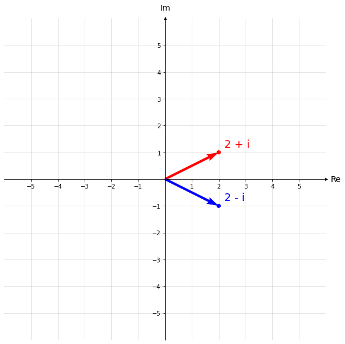
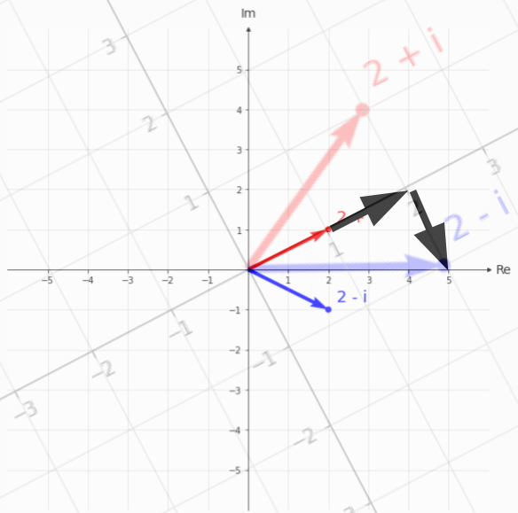

# Imports

```python
import matplotlib.pyplot as plt
import numpy as np
```

# Komplexe Zahlen

## Real- und Imaginärteil

<div style="background-color:lightyellow;border:solid lightgrey;padding:10px;color:black">

**Aufgabe 1:** Findet den Realteil $\mathrm{Re}(z)$ und Imaginärteil $\mathrm{Im}(z)$ der folgenden komplexen Zahlen:

| $z = $                  | $\mathrm{Re}(z) = $ | $\mathrm{Im}(z) = $ |
| ----------------------- | ------------------- | ------------------- |
| $3 + 3i$                | $3$                 | $3$                 |
| $-3.8 - 27i$            | $-3.8$              | $-27$               |
| $\sqrt{-4}$             | $0$                 | $2$                 |
| $7 + \sqrt{-9}$         | $7$                 | $3$                 |
| $4$                     | $4$                 | $0$                 |
| $\sqrt{-16} + \sqrt{4}$ | $2$                 | $4$                 |
| $70i + i^2$             | $-1$                | $70$                |
| $-i$                    | $0$                 | $-1$                |

</div>

## Addition

<div style="background-color:lightyellow;border:solid lightgrey;padding:10px;color:black">

**Aufgabe 2:** Addiert folgende komplexe Zahlen:

| $z_1 = $                       | $z_2 = $                       | $z_1 + z_2 = $                 |
| ------------------------------ | ------------------------------ | ------------------------------ |
| $4 + i$                        | $-2 + 2i$                      | $2 + 3i$                       |
| $-7i$                          | $3 + 7i$                       | $3$                            |
| $\dfrac{1}{2} + \dfrac{1}{3}i$ | $\dfrac{1}{4} + \dfrac{1}{2}i$ | $\dfrac{3}{4} + \dfrac{5}{6}i$ |

</div>

## Multiplikation


```python
# code fuer darstellung
fig, ax = plt.subplots(figsize=(10, 10))

# x,y coordinates and colors of points
x = [2, 2]
y = [1, -1]
txts = np.array(['2 + i', '2 - i'])
color = ['r', 'b',]

# Select length of axes and the space between tick labels
plot_lim = 5
xmin, xmax, ymin, ymax = -plot_lim, plot_lim, -plot_lim, plot_lim
ticks_frequency = 1

# Plot points
ax.scatter(x, y, c=color)

# label points
offset = 0.2
for i, txt in enumerate(txts):
    ax.text(x[i] + offset, y[i] + offset, txt, color=color[i], fontsize=18)

# plot vectors
ax.quiver(np.array(x) * 0, np.array(y) * 0, x, y, color=color, scale=(plot_lim+1)*2)

# Set identical scales for both axes
ax.set(xlim=(xmin-1, xmax+1), ylim=(ymin-1, ymax+1), aspect='equal')

# Set bottom and left spines as x and y axes of coordinate system
ax.spines['bottom'].set_position('zero')
ax.spines['left'].set_position('zero')

# Remove top and right spines
ax.spines['top'].set_visible(False)
ax.spines['right'].set_visible(False)

# Create 'x' and 'y' labels placed at the end of the axes
ax.set_xlabel('Re', size=14, labelpad=15)
ax.set_ylabel('Im', size=14, labelpad=15, rotation=0)
ax.xaxis.set_label_coords(1.03, 0.512)
ax.yaxis.set_label_coords(0.5, 1.02)

# Create custom tick labels
x_ticks = np.arange(xmin, xmax+1, ticks_frequency)
x_ticks_major = x_ticks[x_ticks != 0]
y_ticks = np.arange(ymin, ymax+1, ticks_frequency)
y_ticks_major = y_ticks[y_ticks != 0]
ax.set_xticks(x_ticks_major)
ax.set_yticks(y_ticks_major)
ax.set_xticks(np.arange(xmin,xmax+1), minor=True)
ax.set_yticks(np.arange(ymin,ymax+1), minor=True)

# Draw grid lines
ax.grid(which='major', color='grey', linewidth=1, linestyle='-', alpha=0.2)
ax.grid(which='minor', color='grey', linewidth=1, linestyle='-', alpha=0.2)

# Draw arrows
ax.plot((1), (0), linestyle="", marker=">", markersize=4, color="k",
        transform=ax.get_yaxis_transform(), clip_on=False)
ax.plot((0), (1), linestyle="", marker="^", markersize=4, color="k",
        transform=ax.get_xaxis_transform(), clip_on=False)

plt.show()
```


    

    


<div style="background-color:lightyellow;border:solid lightgrey;padding:10px;color:black">

**Aufgabe 3:** Ohne es algebraisch auszurechnen – was ist das Ergebnis des folgenden Produkts: $(2 + i) \cdot (2 - i)$ (siehe Abbildung)?

</div>

--> $5$


