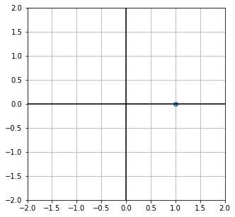
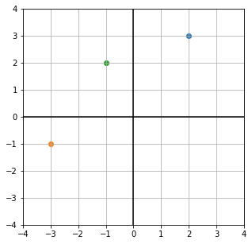
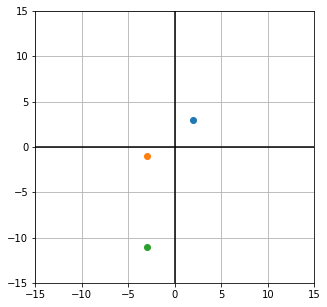

# Imports


```python
import numpy as np
import matplotlib.pyplot as plt
```

# Komplexe Zahlen in Python & NumPy


```python
1 + 1j
```


    (1+1j)


```python
1 + 0j
```


    (1+0j)


```python
a = 1 + 0j
```


```python
type(a)
```


    complex


```python
a.real
```


    1.0


```python
a.imag
```


    0.0


```python
plt.figure(figsize=(5, 5))
plt.scatter([a.real], [a.imag])
plt.plot([-3, 3], [0, 0], c='black')
plt.plot([0, 0], [-3, 3], c='black')
plt.xlim(-2, 2)
plt.ylim(-2, 2)
plt.grid()
```


    

    


```python
a = 2 + 3j
b = -3 - 1j
c = a + b

plt.figure(figsize=(5, 5))


plt.scatter([a.real], [a.imag])
plt.scatter([b.real], [b.imag])
plt.scatter([c.real], [c.imag])


plt.plot([-4, 4], [0, 0], c='black')
plt.plot([0, 0], [-4, 4], c='black')
plt.xlim(-4, 4)
plt.ylim(-4, 4)
plt.grid()
plt.show()
```


    

    


```python
c
```


    (-1+2j)


```python
a = 2 + 3j
b = -3 - 1j
c = a * b

plt.figure(figsize=(5, 5))


plt.scatter([a.real], [a.imag])
plt.scatter([b.real], [b.imag])
plt.scatter([c.real], [c.imag])

lim = 15
plt.plot([-lim, lim], [0, 0], c='black')
plt.plot([0, 0], [-lim, lim], c='black')
plt.xlim(-lim, lim)
plt.ylim(-lim, lim)
plt.grid()
plt.show()
```


    

    


```python
print(np.abs(a))

print(np.sqrt( a.real**2 + a.imag**2 ))


print('\n', np.abs(2 + 0j))
```

    3.605551275463989
    3.605551275463989
    
     2.0


```python
print( np.arctan(a.imag / a.real) / np.pi * 180 )
print( np.arctan2(a.imag, a.real) / np.pi * 180 )
print( np.angle(a) / np.pi * 180 )
```

    56.309932474020215
    56.309932474020215
    56.309932474020215


```python
print(a)
print(np.conjugate(a))
```

    (2+3j)
    (2-3j)


# e-Funktion


```python
# zins und zinseszins

start = 1000

div = 2 # num divisions per year

y = 1 # ... years
y /= div 

rate_per_step = 0.1 # zins
rate_per_step /= div

num_steps = 1 # show results after ... * `y`

print(num_steps / y)

start * (1 + 1 * rate_per_step) ** (num_steps / y)
```

    2.0


    1102.5


---

$e^x = \exp(x) = \lim_{n \to \infty} \left( 1 + \frac xn \right)^n$


```python
def own_exp(x, n=1):
    
    return (1 + x / n) ** n
```


```python
own_exp(1, n=8000)
```


    2.7181119553078


```python
for n in range(1, 200):

    print(n, own_exp(1, n))
```

    1 2.0
    2 2.25
    3 2.37037037037037
    4 2.44140625
    5 2.4883199999999994
    6 2.5216263717421135
    7 2.546499697040712
    8 2.565784513950348
    9 2.5811747917131984
    10 2.5937424601000023
    11 2.6041990118975287
    12 2.613035290224676
    13 2.6206008878857308
    14 2.6271515563008685
    15 2.6328787177279187
    16 2.6379284973666
    17 2.64241437518311
    18 2.6464258210976865
    19 2.650034326640442
    20 2.653297705144422
    21 2.656263213926108
    22 2.658969858537786
    23 2.6614501186387796
    24 2.663731258068599
    25 2.665836331487422
    26 2.6677849665337465
    27 2.6695939778125704
    28 2.6712778534408463
    29 2.6728491439808066
    30 2.6743187758703026
    31 2.6756963059146854
    32 2.676990129378183
    33 2.678207651253779
    34 2.6793554280957674
    35 2.6804392861534603
    36 2.6814644203008586
    37 2.6824354773085255
    38 2.6833566262745787
    39 2.6842316184670922
    40 2.685063838389963
    41 2.6858563475377526
    42 2.686611922032571
    43 2.687333085118294
    44 2.6880221353133043
    45 2.688681170884324
    46 2.689312111189782
    47 2.6899167153502597
    48 2.6904965986289264
    49 2.691053246842418
    50 2.691588029073608
    51 2.6921022089150086
    52 2.692596954437168
    53 2.6930733470476085
    54 2.6935323893818506
    55 2.6939750123475794
    56 2.6944020814263596
    57 2.694814402322114
    58 2.695212726034574
    59 2.6955977534247255
    60 2.6959701393302162
    61 2.696330496282266
    62 2.6966793978678543
    63 2.697017381776468
    64 2.697344952565099
    65 2.6976625841715243
    66 2.6979707222024034
    67 2.6982697860189915
    68 2.698560170641394
    69 2.698842248489487
    70 2.6991163709761854
    71 2.699382869968298
    72 2.6996420591266403
    73 2.699894235137786
    74 2.7001396788468326
    75 2.700378656300911
    76 2.7006114197110898
    77 2.700838208340397
    78 2.7010592493240737
    79 2.701274758428429
    80 2.7014849407533275
    81 2.701689991383461
    82 2.701890095991989
    83 2.7020854314015796
    84 2.7022761661054715
    85 2.702462460752151
    86 2.7026444685967603
    87 2.702822335921502
    88 2.702996202427776
    89 2.7031662016021554
    90 2.703332461058186
    91 2.703495102855847
    92 2.7036542438003983
    93 2.703809995722089
    94 2.703962465738423
    95 2.704111756499579
    96 2.7042579664191284
    97 2.7044011898901603
    98 2.7045415174887277
    99 2.704679036164753
    100 2.7048138294215285
    101 2.7049459774851603
    102 2.705075557463504
    103 2.7052026434963605
    104 2.7053273068967987
    105 2.705449616284729
    106 2.705569637712799
    107 2.7056874347851623
    108 2.7058030687704
    109 2.7059165987070446
    110 2.7060280815047544
    111 2.7061375720390206
    112 2.706245123241461
    113 2.706350786184983
    114 2.7064546101647613
    115 2.706556642774879
    116 2.706656929981162
    117 2.7067555161900714
    118 2.706852444314376
    119 2.7069477558354027
    120 2.7070414908622435
    121 2.707133688188016
    122 2.7072243853433786
    123 2.7073136186475804
    124 2.707401423256779
    125 2.7074878332103167
    126 2.7075728814747357
    127 2.7076565999857247
    128 2.7077390196880207
    129 2.7078201705736085
    130 2.7079000817180776
    131 2.7079787813153984
    132 2.7080562967111232
    133 2.708132654433869
    134 2.7082078802257286
    135 2.7082819990713864
    136 2.7083550352254617
    137 2.708427012239114
    138 2.7084979529852773
    139 2.7085678796831387
    140 2.7086368139211445
    141 2.7087047766791463
    142 2.7087717883499662
    143 2.708837868759473
    144 2.7089030371862597
    145 2.7089673123806697
    146 2.7090307125823254
    147 2.7090932555376694
    148 2.709154958516498
    149 2.7092158383277742
    150 2.709275911334851
    151 2.7093351934705265
    152 2.7093937002504522
    153 2.7094514467873294
    154 2.7095084478035383
    155 2.709564717643635
    156 2.709620270286827
    157 2.7096751193579265
    158 2.7097292781389424
    159 2.7097827595795927
    160 2.7098355763078152
    161 2.709887740639328
    162 2.7099392645878924
    163 2.709990159873631
    164 2.710040437932739
    165 2.710090109925527
    166 2.7101391867449083
    167 2.7101876790242274
    168 2.7102355971452643
    169 2.710282951245167
    170 2.7103297512238647
    171 2.710376006751046
    172 2.710421727272701
    173 2.7104669220174693
    174 2.7105116000029934
    175 2.710555770041915
    176 2.7105994407475107
    177 2.7106426205396774
    178 2.7106853176496353
    179 2.7107275401261237
    180 2.7107692958394067
    181 2.7108105924871326
    182 2.7108514375982247
    183 2.71089183853824
    184 2.710931802513102
    185 2.710971336573943
    186 2.7110104476208314
    187 2.711049142406988
    188 2.7110874275426164
    189 2.711125309498924
    190 2.711162794611157
    191 2.711199889082793
    192 2.7112365989886458
    193 2.7112729302782266
    194 2.711308888778786
    195 2.7113444801988122
    196 2.711379710130714
    197 2.711414584053919
    198 2.7114491073377014
    199 2.7114832852438147


```python
for n in range(1, 200):

    result = own_exp(1j * np.pi, n)

    print(n, result)
    
    plt.figure(figsize=(5, 5))

    plt.scatter([result.real], [result.imag])
    
    lim = 6
    plt.plot([-lim, lim], [0, 0], c='black')
    plt.plot([0, 0], [-lim, lim], c='black')
    plt.xlim(-lim, lim)
    plt.ylim(-lim, lim)
    plt.grid()
    plt.show()
```


